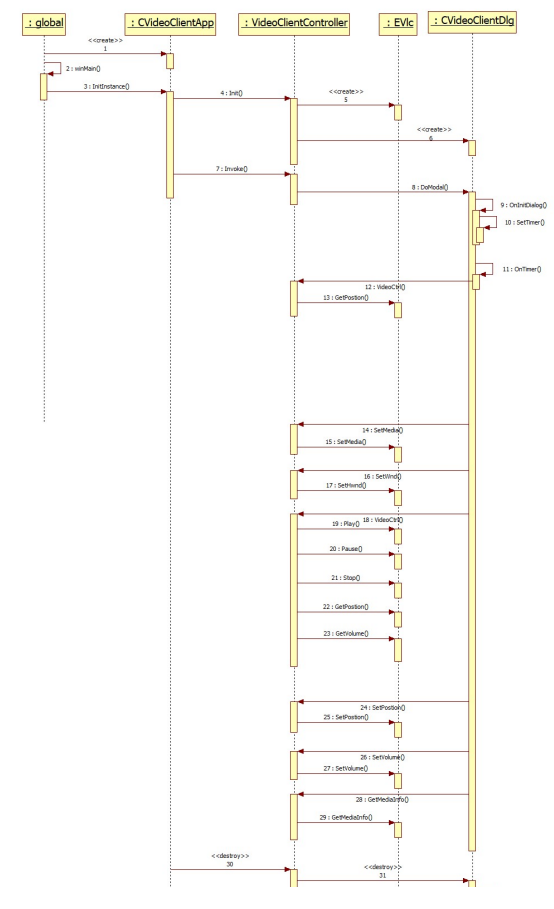
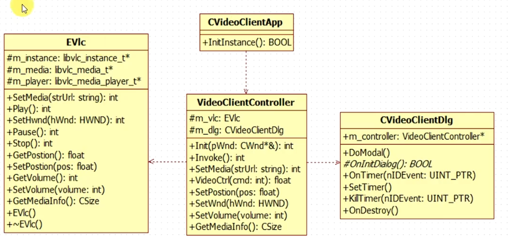

# 视频播放器
-----
## [客户端设计思路]
1. 架构：MVC
2. 需求：播放、暂停/继续、停止、进度显示、跳转位置、地址输入等基本功能
3. 核心功能：libvlc
## [模块设计]
app -> controller -> dlg
                       ^ 
                       |
app -> controller -> vlc

1. CVideoClientApp模块
    **接口：**
    InitInstance

2. UI模块 CVideoClientDlg
**接口：**
    Play、Pause、Stop响应接口
    定时器OnTimer（刷新进度条）
    滑动条拖动响应接口
    地址输入的变量

1. libVLC模块 CEVlc
   
**接口：**
    初始化
    设置播放窗口
    设置播放地址
    播放/暂停/停止/音量/位置
    销毁

4. 控制层模块 CVideoClientController
    协调UI和VLC
    **接口：**
    初始化（播放窗口设置）
    响应播放、暂停、地址、停止、音量、进度
    关闭

## [详细设计]
1. 时序图
    

2. 类图
   

