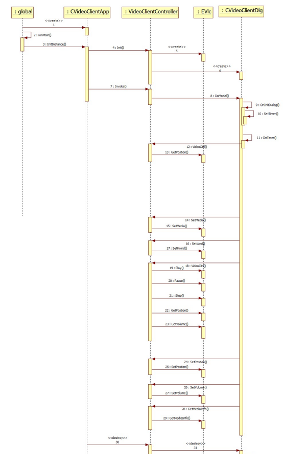
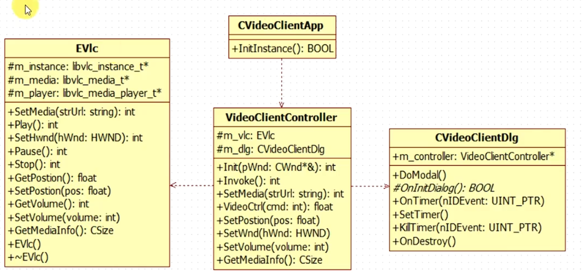

# 视频播放器
-----
## [客户端设计思路]
1. 架构：MVC
2. 需求：播放、暂停/继续、停止、进度显示、跳转位置、地址输入等基本功能
3. 核心功能：libvlc
## [模块设计]
app -> controller -> dlg
                       ^ 
                       |
app -> controller -> vlc

1. CVideoClientApp模块
    **接口：**
    InitInstance

2. UI模块 CVideoClientDlg
**接口：**
    Play、Pause、Stop响应接口
    定时器OnTimer（刷新进度条）
    滑动条拖动响应接口
    地址输入的变量

1. libVLC模块 CEVlc
   
**接口：**
    初始化
    设置播放窗口
    设置播放地址
    播放/暂停/停止/音量/位置
    销毁

4. 控制层模块 CVideoClientController
    协调UI和VLC
    **接口：**
    初始化（播放窗口设置）
    响应播放、暂停、地址、停止、音量、进度
    关闭

## [详细设计]
1. 时序图
    

2. 类图
   

## [性能测试]
### 服务器性能测试关注的指标：
1. 吞吐量、平均吞吐量、峰值吞吐量、最低吞吐量 
服务器在单位时间内能够处理的请求或传输的数据量，通常以 请求数/秒（Requests Per Second, RPS） 或 数据量/秒（Mbps、Gbps） 来衡量
2. 响应时间、平均响应时间、中间响应时间、最小响应时间、最大响应时间
3. CPU占用率、内存占用率、磁盘I/O、占用率

### 如何设计服务器性能测试
1. 使用iocp/epoll 进行客户端开发
2. 使用工具进行性能测试（locust的使用）
3. 服务器性能测试必须要考虑硬件环境

## [稳定性测试]
### 服务器稳定性常见指标
1. 平均无故障运行时间（MEEF）越大越好
2. 平均故障时间（MTBF）越小越好
3. 平均修复时间（MTTR）越小越好

### 如何设计服务器的稳定性测试
1. 压力测试 一个是时间稳定性，一个是数量稳定性, 压力测试是一次性推到极限，看看服务器什么时候会崩溃
2. 增量测试 单位时间内新增请求数， 增量测试是逐步增加负载，看看服务器在不同负载阶段的表现。
3. 容错性测试 接口调用的数据、权限、内容、格式等等出现错误